## Python build a simple blockchain（利用Python 开发一个区块链 ）

### 博客地址：http://www.enpeizhao.com/?p=985

#### 目录

1. 运行方法
2. 目的
3. 数据结构
4. Transaction （交易）
5. Proof-of-work
6. Hashing（哈希）
7. Hashcash
8. Nodes（节点）和p2p网络
   1. Full node
   2. mining node
   3. SPV node
   4. Consensus（共识算法）
9. 测试
10. 评价


***

#### 运行方法

duck_chain包含四个文件：duckchain.py、fullNode.py、miningNode.py、spvNode.py。

建议使用virtualenv构建Python2.7环境

1. 运行full node：`python fullNode.py`暂时只支持一个full node，端口：5000，相关API：

   1. `http://localhost:5000/list_blocks`：get请求，列出节点上的所有区块信息；
   2. `http://localhost:5000/full/register_node/`：post请求，注册节点信息；
   3. `http://localhost:5000/full/list_nodes/`：get请求，列出网络上所有节点的地址；
   4. `http://localhost:5000/full/validate_block/`：get请求，对mining node产生的proof进行验证；

2. 运行mining node：`python miningNode.py port` 可支持多个mining node，使用不同的端口即可，如`python miningNode.py 5001`、`python miningNode.py 5002`，相关API：

   1. `http://localhost:port/list_blocks`：get请求，列出节点上的所有区块信息；
   2. `http://localhost:port/mining/mine/`：get请求，挖矿，解决proof-of-work；


3. 运行SPV node：`python spvNode.py port` 可支持多个SPV node，使用不同的端口即可，如`python spvNode.py 5003`、`python spvNode.py 5004`，相关API：
   1. `http://localhost:port/list_blocks`：get请求，列出节点上的所有区块信息；
   2. `http://localhost:port/spv/new_transaction/`：post请求，插入交易信息；


#### 目的

> “What I cannot create, I do not understand.” – [Richard Feynman](https://en.m.wikiquote.org/wiki/Richard_Feynman)

正如这句名言，理解一个事物最好的办法就是亲自设计制作它，本文将介绍一个简单的区块链系统的开发过程，用于理解区块链基本工作原理，我称它为duck_chain。

主要功能特色如下：

1. 使用python开发；
2. 已实现基本的节点操作：
   1. Full node（全节点）：网络路由功能、节点注册、验证区块，决策等功能；
   2. Mining node（挖矿节点）：计算Proof-of-work，挖矿等；
   3. SPV（Simplified Payment Verification，支付验证节点）：交易等功能；
3. 使用HTTP模拟P2P网络，区块自动更新。

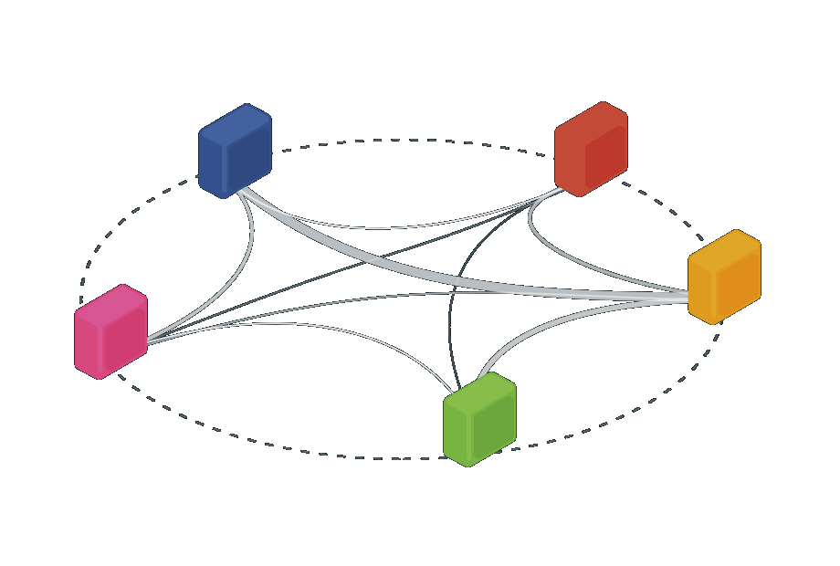

#### 数据结构

> 区块链是一种分布式、安全、可靠、加密的数据存储技术 – 其特点是 去中心化、不可篡改、开放透明、可审计。

区块链的基本单位是一个个区块，如下图：

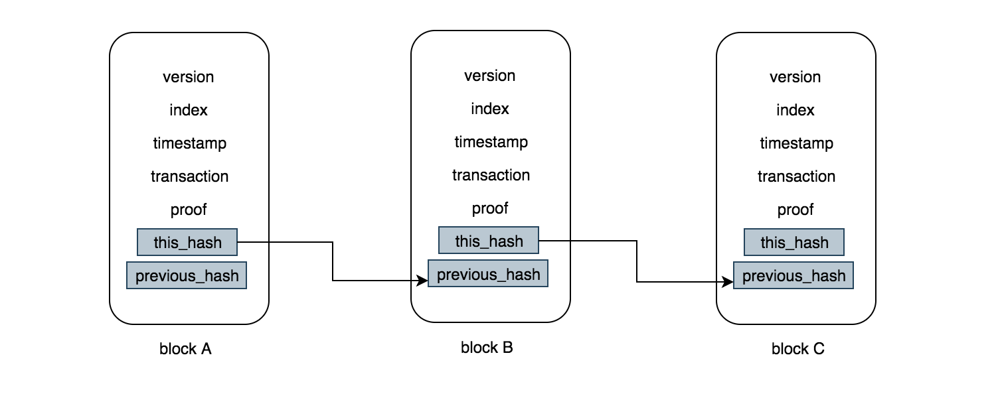

每个区块主要包含以下数据：

* Version：版本号；
* index：索引，表示区块位置；
* timestamp：时间戳，记录区块产生的时间；
* transaction（data）：数据，区块本身携带的数据，可以为任何数据，在比特币中为交易数据；
* proof：本区块Proof-of-work的求解，稍后详细介绍；
* this_hash：本区块的哈希值；
* previous_hash：上一个区块的哈希值

用json表示一个区块，例如：

```json
{
      	"data": [],
        "index": 3,
        "previous_hash": "8da8256e2d9797a3fed2cc93bf3e9b38cdf89a3e35f04c0a15b75b707db4b6fd",
        "proof": 91820,
        "this_hash": "edca35b8270f5fb1e45858ad839fab2d54bab1136648c97cb044a69e3e10a86e",
        "timestamp": 1537429551.642325,
        "version": 1
    }
```

**由于每一个区块都包含上一个区块的哈希值，所以区块链实际上就是由这些哈希值链接起来的。**

#### Transaction （交易）

区块链上的交易信息都直接存在区块的data中，每笔交易包含交易额、收发方、时间信息，每新产生一个区块，系统便会奖励矿工（miner）一定数额的币，`sender=0`表示为系统奖励

```json
{
	"data": [
	    {
	        "amount": 1,
	        "receiver": "81d130d24fcc421f935f52f4c5f632b7",
	        "sender": 0,
	        "timestamp": 1537429551.883901
	    }
	],
}
```

创建一个blockchain的类，并用一个list保存这些区块信息

```python
class Blockchain:
	def __init__(self):
		self.blocks = []
        
    def hash(self,block):
		pass
```

#### Proof-of-work

物以稀为贵，如果区块链中的区块可以轻松产生，那区块链也没什么价值，设计者需要刻意给矿工设置了一些“难题”，只有正确解决这些难题，才会产生一枚新的区块，同时奖励矿工一定数额的电子货币，这个机制便成为“Proof-of-work”。

Proof-of-work算法必须具备“难求解、易验证”的特点。

#### Hashing（哈希）

哈希算法作用是把任意长度的输入变换成固定长度的输出：

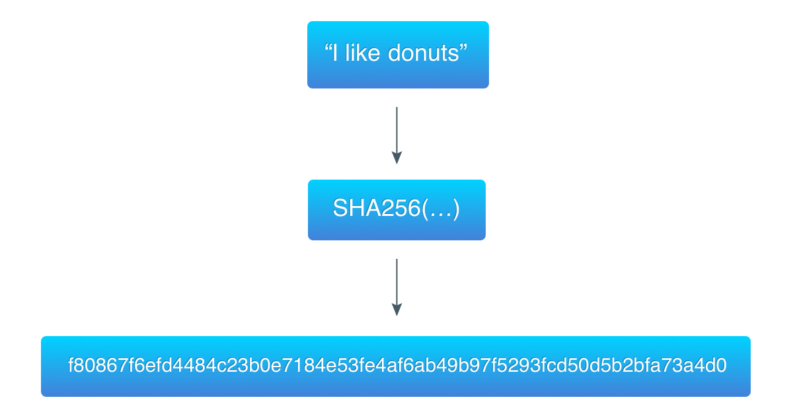

哈希算法主要有如下特征：

1. 原始数据不可以根据哈希值还原；
2. 特定数据只能产生唯一的哈希值；
3. 两份原始数据哪怕只有细微区别，产生的哈希值也会完全不同。

哈希值可以保证区块链的一致性，因为每个区块的哈希值都是根据上一个区块的哈希值计算的，要想修改某个区块，就必须重新计算后面所有的区块的哈希值。

我们完善一下区块的哈希计算函数：

```python
def hash(self,block):
	"""
	generate hash of a block

	:param block: <json> json format block
	:return: <json> sha256 hash of the block

	"""
	block_string = json.dumps(block, sort_keys=True).encode()
	return hashlib.sha256(block_string).hexdigest()
```

#### Hashcash

比特币使用hashcash作为Proof-of-work算法，hashcash最早是为拦截垃圾邮件而发明的，算法主要步骤如下：

1. 选取已知的字符串数据data（如邮件地址，区块链的头信息）；
2. 为数据data加一个累加变量counter，counter从0开始；
3. 计算（data+counter）的哈希值hash；
4. 检查hash是否满足特定求解要求：
   1. 满足：完成；
   2. 不满足：将counter+1，重复3、4步骤。

Hashcash是一个暴力求解的算法，非常消耗算力，也难怪会有成堆GPU组成的“矿厂”：

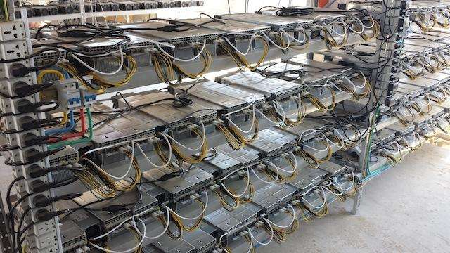


Hashcash 算法需要满足哈希值的前20位必须全部为0，满足的位数称为targetBits，调整targetBits的大小也就调整了Proof-of-work的难度（targetBits越大求解POW越难），在比特币中，targetBits的大小是动态调整的，因为要保证比特币按设计每10分钟产生一枚，区块链则需要调整难度以抵消矿工算力的提升。


如上图ca07ca是13240266的十六进制形式，`data="I like donuts"`，`data+counter`的哈希值前6位为0。

为了降低挖矿难度，duck_chain的targetBits设置为4：

```python
def proof_of_work(self,previous_block):
	proof = 0
	while not self.validate_proof(proof,previous_block):
		proof += 1
	return proof

def validate_proof(self,proof,previous_block):
	previous_proof = previous_block['proof']
	previous_hash = previous_block['this_hash']
	proof_str = str( proof * previous_proof) + previous_hash
	result = hashlib.sha256(proof_str).hexdigest()
	return result[:4] == "0000"
```

#### Nodes（节点）和p2p网络

区块链是去中心化的，网络拓扑是一个p2p（peer to peer）的网络结构，网络上的节点（nodes）按分工不同主要分为full nodes（全节点），mining nodes（挖矿节点），SPV node（支付验证节点）。

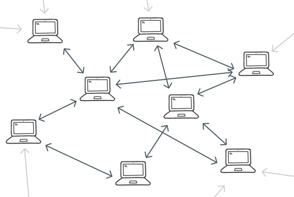


##### Full node

主要功能：路由、注册节点、验证区块，决策等，使用Python flask构建网络API，代码片段如下：

```python
# instantiate the full node
app = Flask(__name__)
# instantiate the blockchain
blockchain = Blockchain()

@app.route('/full/register_node/',methods=['post'])
def register_node():
	pass

@app.route('/full/list_nodes/',methods=['get'])
def list_nodes():
	pass

@app.route('/full/validate_block/',methods=['get'])
def validate_new_block():
	pass
```

##### mining node

主要功能：路由、挖矿等，代码片段如下：

```python
@app.route('/mining/mine', methods=['get'])
def mine():
	pass
```

##### SPV node

主要功能：验证交易等，代码片段如下：

```python
@app.route('/spv/new_transaction/',methods=['post'])
def register_node():
	pass
```

##### Consensus（共识算法）

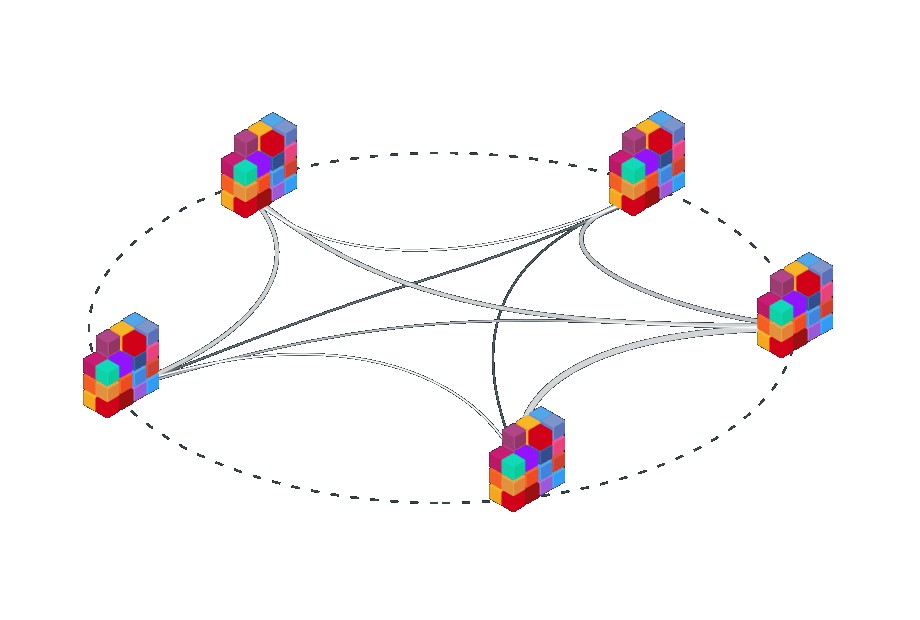

为了保证区块链上的所有节点拥有一致的区块信息，需要“共识”机制同步所有节点的信息，duck_chain采取一个最简单的策略：如发现网络上其他节点的区块链长度大于本节点链长，则替换为最长的区块链。duck_chain每个节点中包含一个定期执行（10秒）的` sync_blocks()`函数用于保证区块链的共识：

```python
def sync_blocks():
    pass
```

#### 测试

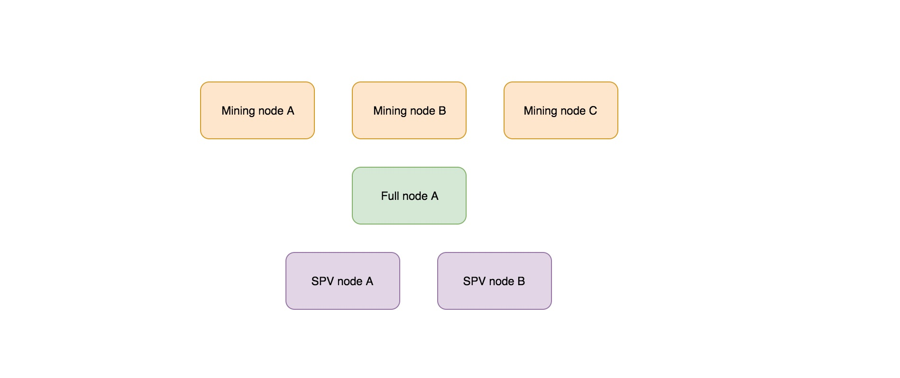

##### 测试步骤

| 测试序号 | 行为                                                         | 预期                                                         |
| -------- | ------------------------------------------------------------ | ------------------------------------------------------------ |
| 1        | 创建1个**Full node A**（地址：localhost:5000）； <br><br>创建3个**mining node A、B、C**（地址：localhost:5001、localhost:5002、localhost:5003）；  <br><br>创建2个**SPV node A、B**（地址：localhost:5004、localhost:5005）； | 第一个block（genesis block）会在Full node A产生，10秒后同步至其他5个节点； |
| 2        | 在mining node A 挖出第2个block                               | 10秒后同步至其他5个节点；                                    |
| 3        | 在mining node A 挖出第3个block                               | 10秒后同步至其他5个节点；                                    |
| 4        | 在mining node C 挖出第4个block                               | 10秒后同步至其他5个节点；                                    |
| 5        | 在mining node C 挖出第5个block                               | 10秒后同步至其他5个节点；                                    |
| 6        | 在SPV node A 创建一笔交易，将交易存入第2个block              | 第2个block包含交易信息                                       |

##### 测试结果：

###### 测试1

使用postman获取节点区块列表信息

Full node A（地址：localhost:5000）：

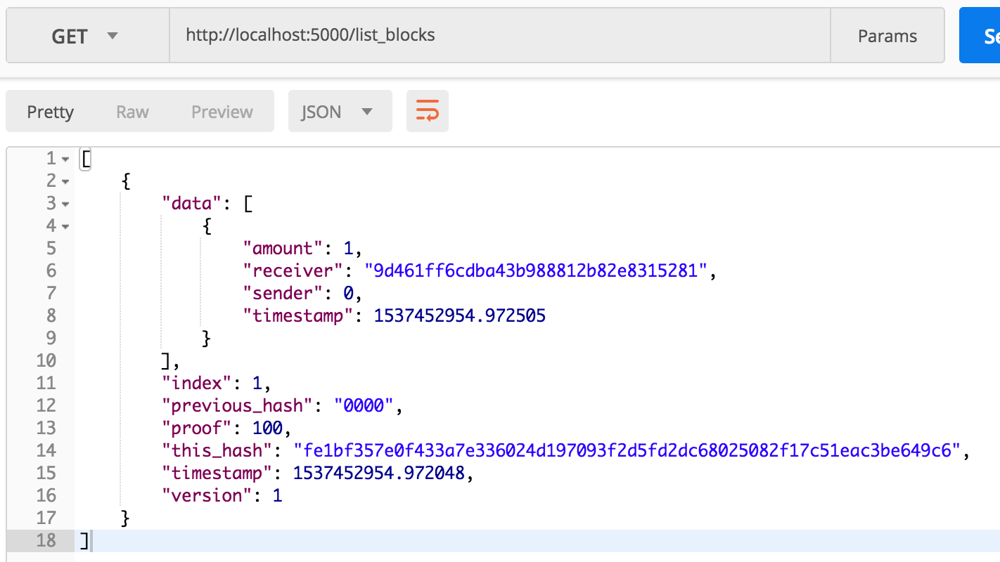

mining node A（地址：localhost:5001）：

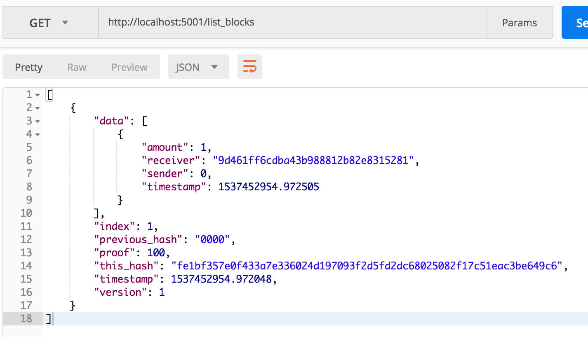

SPV node A（地址：localhost:5004）：

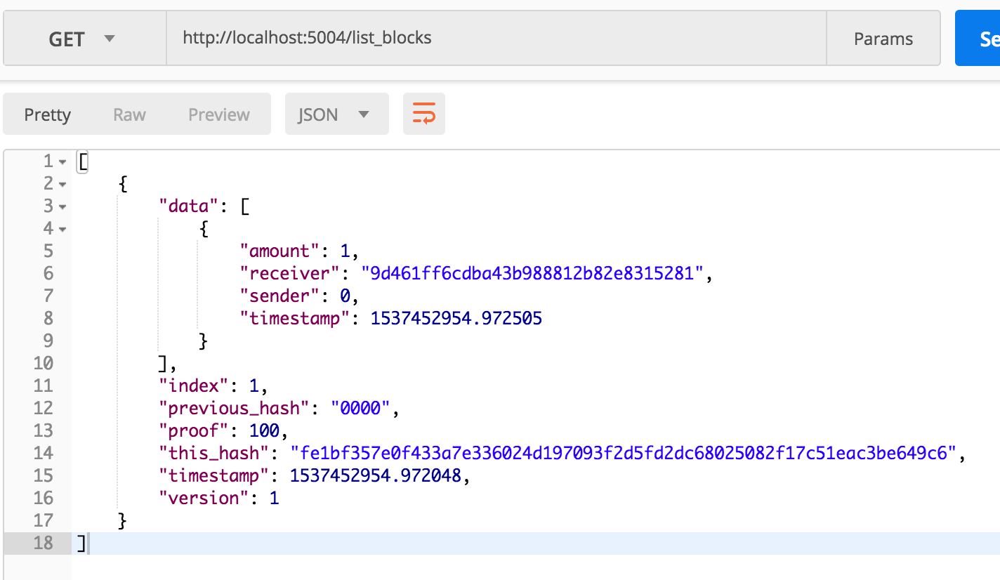

可以发现三类节点中区块链信息完全一致。

###### 测试2

在mining node A （地址：localhost:5001）挖出第2个block：

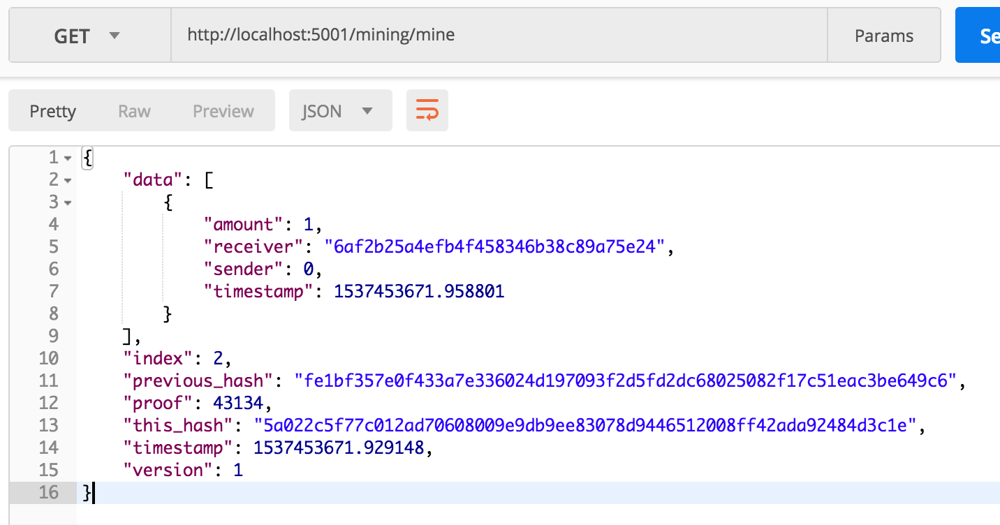

检查一下full node A、mining node C、SPV node B：

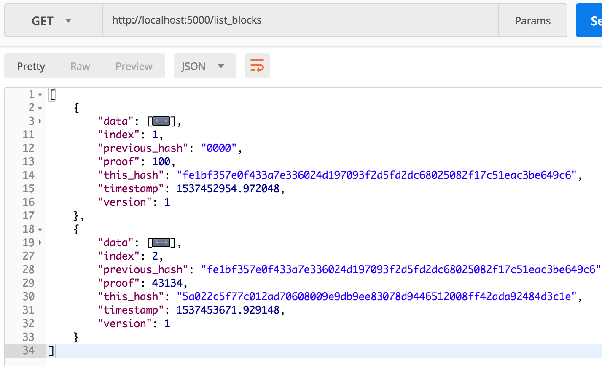


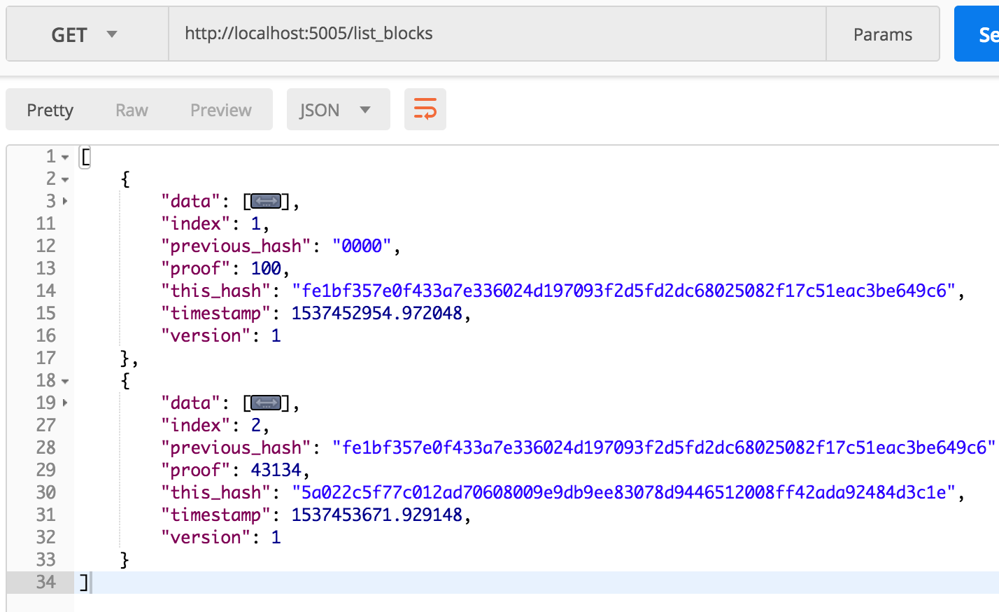

可以发现三类节点中区块链信息完全一致，都更新了index=2的区块。

继续执行测试3、4、5，都得到预期结果：

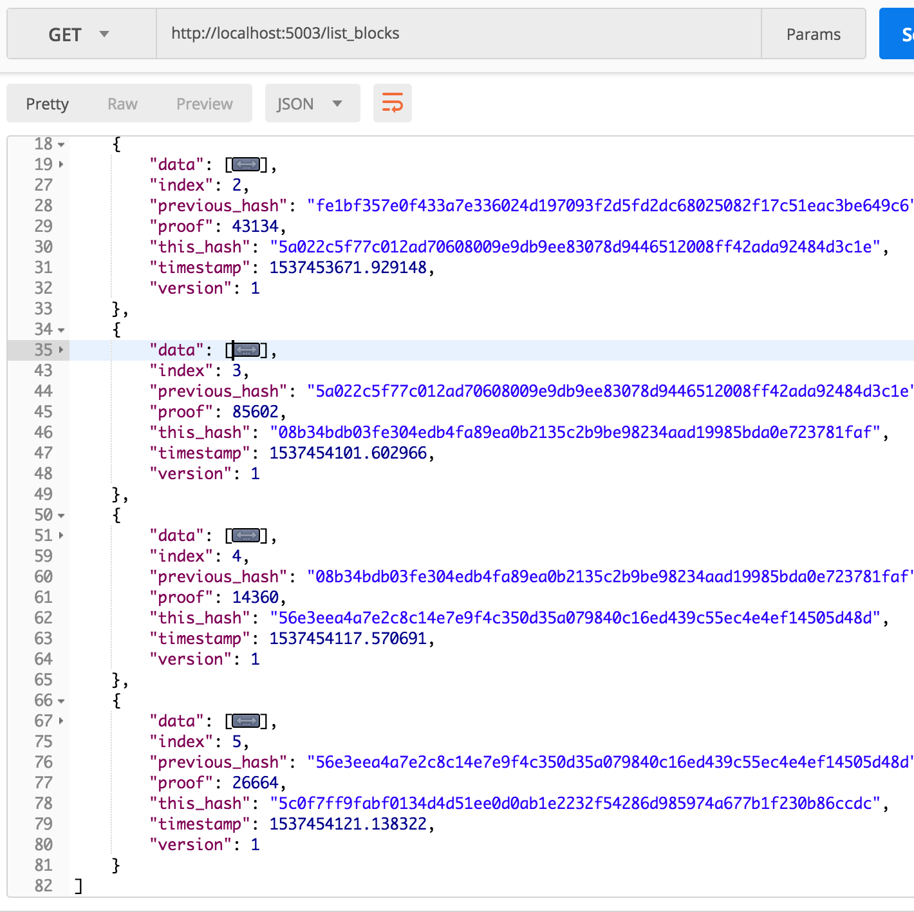

###### 测试6

使用postman发送如下交易信息：

```json
{
		"sender":"enpeizhao",
		"receiver":"abcdefghijklmnopqrstuvwxyz",
		"amount":1,
		"block_index": 1	
}
```

结果：

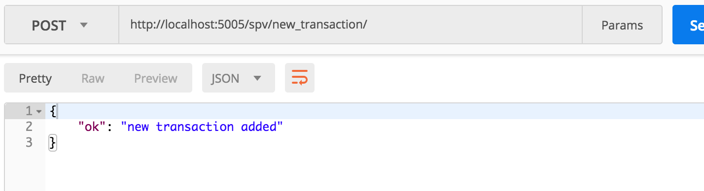

查看一下区块链：

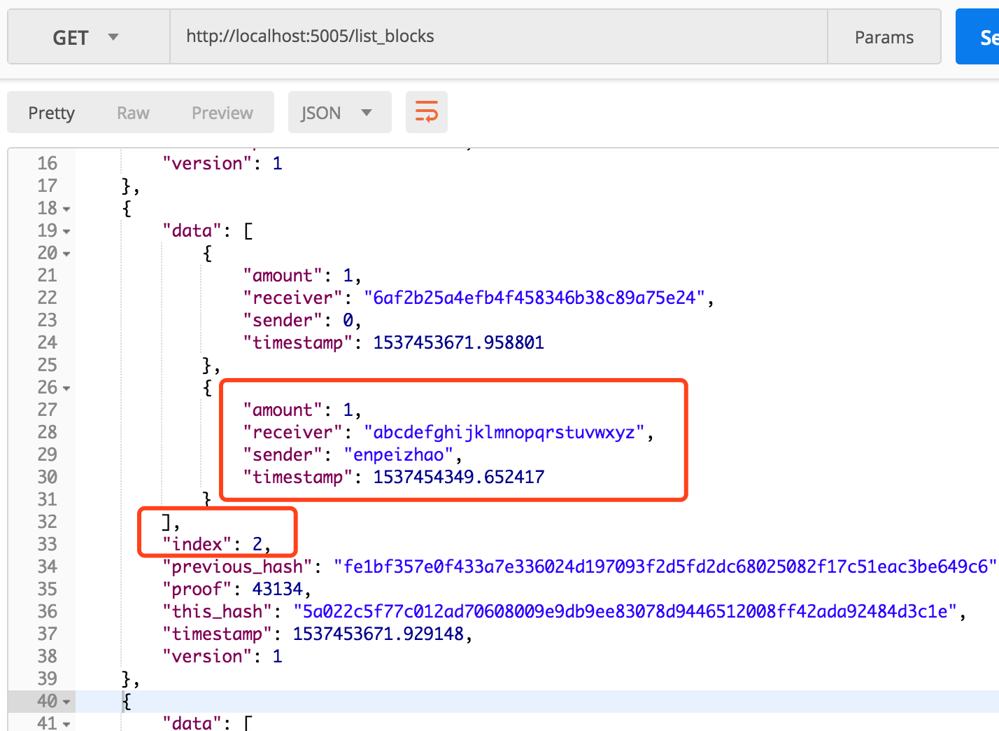

交易信息已成功插入第二块区块。


#### 评价

Duck_chain已实现了区块链基本的功能，但距离真实可用的系统还差的很远：

1. 没有实现真正的p2p网络；
2. Proof-of-work算法较简单；
3. 共识机制较简单；
4. 未使用数据库、文件存储区块信息；
5. 未使用merkle tree等数据结构检索信息；
6. 未实现个人钱包、个人转账功能；
7. 其他......

#### 完整代码

项目代码已托管至GitHub：[https://github.com/enpeizhao/duck_chain](https://github.com/enpeizhao/duck_chain)
